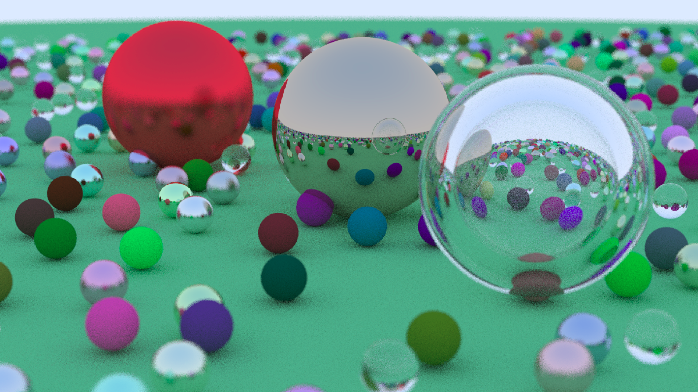

# Simple c-raytracer
## written using guides from [rtweekend book](https://raytracing.github.io/books/RayTracingInOneWeekend.html)

## Features
- objects: sphere
- materials: lambertian (diffusive), metal, dielectric (refractive)
- output file format: .ppm

## Usage
1. `make`
2. `build/raytracer > image.ppm`
3. open image.ppm with your favorite image viewer

Edit src/main.c for changing scene, camera, render or image.
